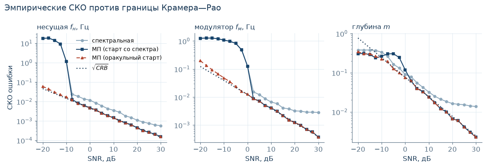
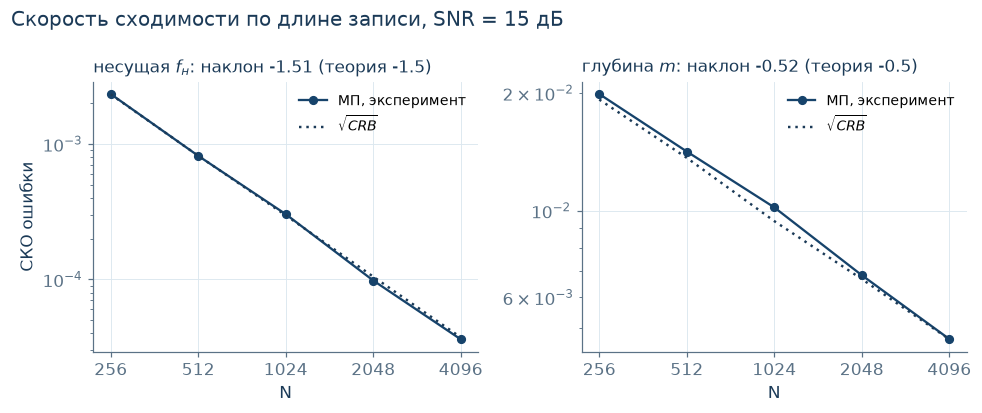
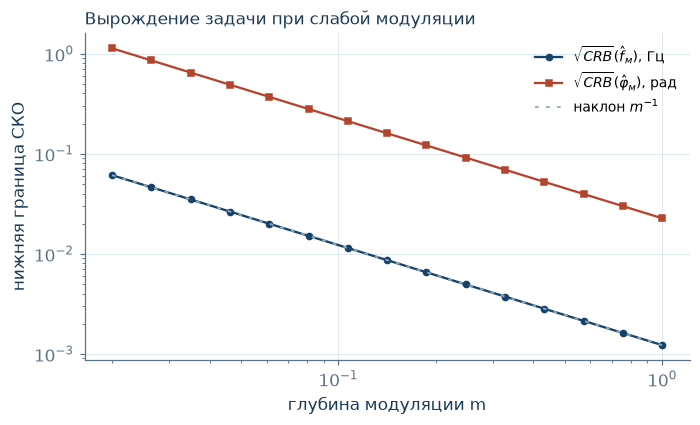
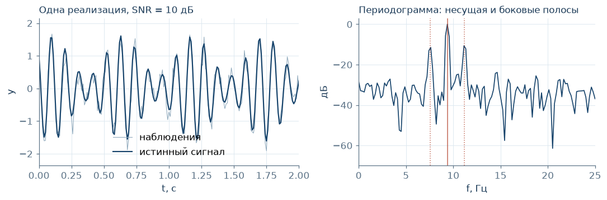

# Оценка параметров АМ-сигнала на фоне шума: где ломается максимальное правдоподобие

  

Обратная задача: по зашумлённой записи амплитудно-модулированного сигнала восстановить
частоту несущей, частоту модулятора и глубину модуляции. Метод максимального правдоподобия
против спектрального оценивания, граница Крамера—Рао как теоретический предел — и главный
вопрос: **не насколько хорош метод выше порога, а что именно отказывает ниже него.**

## Главный результат: порог двухслойный



Обычно пороговый эффект описывают как одно явление: ниже некоторого SNR оценка
разваливается. Здесь он расслаивается на два независимых механизма — и различить их
позволяет третья кривая на графике, МП с **оракульным стартом** (красная).

Синяя кривая — МП с инициализацией по спектру — обрывается вверх на пороге. Красная,
стартующая из истинного значения, продолжает лежать на границе Крамера—Рао (пунктир)
вплоть до −20 дБ. Значит:

1. **Сначала отказывает инициализация** — алгоритм захватывает ложный пик периодограммы.
   Это провал метода, а не нехватка информации в данных.
2. **И только глубже кончается сама информация.** Пока оракульный старт держится на CRB,
   данные ещё содержат ответ — его просто не находит спектральная инициализация.

У порога есть «этажность»: параметры модулятора разваливаются примерно на **10 дБ раньше**
несущей, потому что боковые полосы слабее. При `N = 512` порог по частоте модулятора
≈ **0 дБ**, по несущей ≈ **−10 дБ**.

Практический вывод: ниже порога улучшать оптимизатор бессмысленно — надо чинить
инициализацию, и до −20 дБ это ещё окупается.

## Проверка теории числами

| Что проверялось | Предсказание | Измерено |
|---|---|---|
| Эффективность МП выше порога | СКО совпадает с CRB | ✅ по всем трём параметрам |
| Сходимость по длине записи, частота | `N^(−3/2)` | **−1.51** |
| Сходимость по длине записи, глубина | `N^(−1/2)` | **−0.52** |
| Идентифицируемость при `m → 0` | вырождение матрицы Фишера | ✅ СКО растёт как `m^(−1)` |



Наклоны −1.51 и −0.52 против теоретических −1.5 и −0.5 — согласуется с классическим
результатом Rife & Boorstyn (1974).

### Вырождение при слабой модуляции



При `m → 0` боковые полосы исчезают, и частота модулятора перестаёт быть определимой
в принципе. Это свойство самой задачи — вырождение информационной матрицы Фишера, —
а не дефект конкретного метода: никакой оценщик здесь не поможет.

## Постановка



Слева — одна реализация сигнала в шуме, справа — её периодограмма с несущей и боковыми
полосами. Спектральная оценка берёт положения пиков; МП максимизирует правдоподобие,
стартуя из этих положений.

Вывод формул, весь код и остальные графики — в
[`research/parameter_estimation.ipynb`](research/parameter_estimation.ipynb).

## Структура

```text
research/    исследование — содержательная часть
└── parameter_estimation.ipynb    МП vs спектральная оценка, CRB, Монте-Карло,
                                  порог, идентифицируемость
core/        C++17: наивное ДПФ и БПФ Кули—Тьюки, самопроверка, бенчмарк
demo/        интерактивная иллюстрация постановки (АМ/ЧМ/кольцевая, Web Audio)
docs/        графики из ноутбука
```

БПФ написан с нуля, без FFTW и без `numpy.fft`, — чтобы разница `O(N log N)` против
`O(N²)` была видна на бенчмарке, а не принята на веру.

## Воспроизведение

```sh
python3 -m venv .venv
.venv/bin/pip install -r research/requirements.txt
```

Открыть ноутбук в Jupyter или VS Code с ядром из `.venv`; полный прогон — около минуты.

```sh
cd core && make run    # C++: тесты БПФ + бенчмарк
```

Демонстрация — открыть `demo/modulation.html` в браузере, собирать ничего не нужно.

## Что дальше

- **ЧМ-сигнал**: инициализация по гребёнке Бесселя, сравнение с АМ по устойчивости
- **Окрашенный и негауссов шум**: обобщённый МНК, робастные функции потерь
- **Байесовская постановка**: порог как перестройка апостериорной плотности, а не как обрыв
- **Монте-Карло-контур на C++**: сейчас на нём только БПФ, см. `core/`
- **Нейросетевая эволюция**: амортизированный estimator (SBI / neural posterior) против
  классики — сходится ли он к границе Крамера—Рао

Литература — в конце ноутбука.
